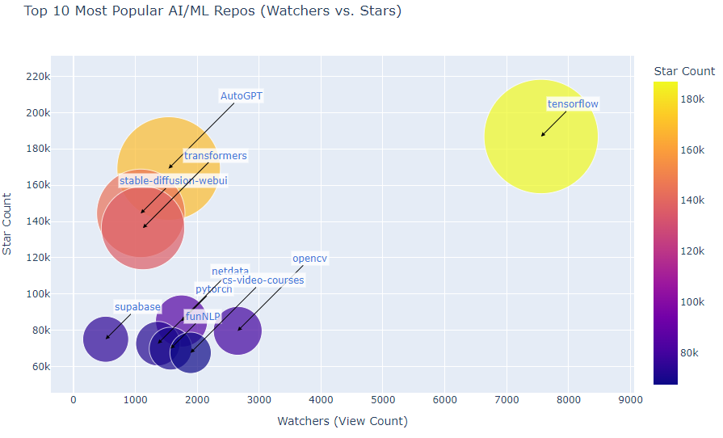
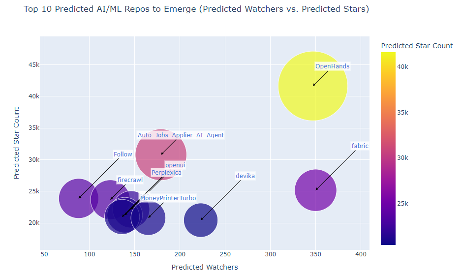

# **AI/ML Repository Analysis and Prediction Dashboard**

## **Project Overview**
This project analyzes trending GitHub repositories in AI/ML-related fields (Machine Learning, Deep Learning, Artificial Intelligence, Data Science, etc.) and predicts potential growth in terms of stars and watchers over the next six months. The project provides:
1. A list of the **Top 10 most popular AI/ML repositories** based on current star count.
2. Predictions of the **Top 10 emerging AI/ML repositories** using time-series modeling and logarithmic growth simulation.

The visualized results are presented as interactive dashboards.

---

## **How It Works**
1. **Data Collection**:
   - The GitHub REST API is used to fetch repositories matching AI/ML keywords.
   - Data such as stars, watchers, language, and last updated time are collected.

2. **Data Processing**:
   - Repositories are filtered to exclude certain languages (e.g., HTML).
   - Repositories are sorted by their current star count to identify the most popular ones.
   - Logarithmic growth and Exponential Smoothing are applied to simulate future star and watcher counts.

3. **Visualization**:
   - Two bubble charts are generated:
     - **Top 10 Current Popular AI/ML Repositories**.
     - **Top 10 Predicted AI/ML Repositories**.
   - Each chart displays watchers (x-axis), stars (y-axis), and relative bubble sizes for clarity.

---

## **Interactive Dashboards**

You can view the **Top 10 Predicted Repositories Dashboard** here:  
👉 [Top 10 Predicted Repositories](https://breannajg.github.io/Breanna-George-Capstone-Project-24.1-Final-Report/127.0.0.1.html)

---

## **Results Displayed in Key Visuals**

1. **Top 10 Current AI/ML Repositories**: Based on the number of stars.  


2. **Top 10 Predicted AI/ML Repositories**: Using time-series models to forecast star growth and watchers.  


---

## **Tools and Technologies Used**
- **Python**: For data collection, processing, and prediction.
- **Libraries**:
   - `requests`: Fetch data from the GitHub API.
   - `pandas`: Data analysis and manipulation.
   - `statsmodels`: Time-series forecasting using Exponential Smoothing.
   - `plotly`: Interactive visualizations (bubble charts).
   - `numpy` and `math`: Simulation of logarithmic growth.
- **GitHub REST API**: Data source.
- **GitHub Pages**: Hosting the interactive dashboard.

---

## **How to Run the Code**
1. Clone this repository & run file:
   ```bash
   pip install requests pandas statsmodels numpy plotly
   python gitpoc13.py

---

## **Acknowledgments**
- **Github API**: For providing the data
- **Python libraries**: For enabling analysis and visualization.
- **Visual Studio IDE**: While I did preliminary coding on Jupyter Notebook, I was able to deploy more efficiently through VS Code

